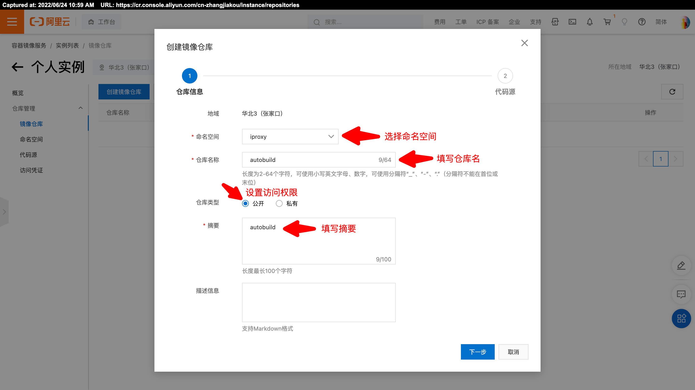
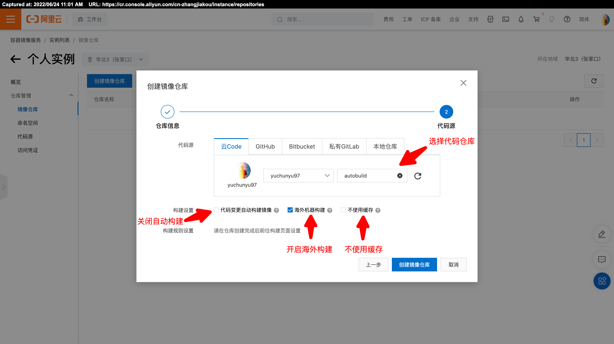

# toolset-golang
工具集（Golang）


## iproxy 海外镜像拉取工具

基于阿里云容器镜像服务。

### 工具安装

```bash
go install github.com/yuchunyu97/toolset-golang/cmd/iproxy@latest
```

### 工具使用

准备工作：
- 获取阿里云 AccessKey
- 开通[阿里云容器镜像服务（个人版）](https://cr.console.aliyun.com/)
- 准备一个 Git 仓库，推荐[阿里云 CODE](https://code.aliyun.com/)

Git 仓库需要初始化完成，建议创建一个默认的 README.md。

然后，创建一个镜像仓库：





准备好后，进行工具配置（只需要配置一次）：

```bash
# 初始化配置文件
mkdir -p $HOME/.toolset && touch $HOME/.toolset/config.yaml
iproxy -i

# 修改配置文件，参考 configs/config-iproxy.yaml
vim $HOME/.toolset/config.yaml
```

最后，就可以进行镜像拉取了：

```bash
# 拉取镜像
iproxy -n nginx

# 拉取镜像，并下载到本地
iproxy -n nginx -d
```
